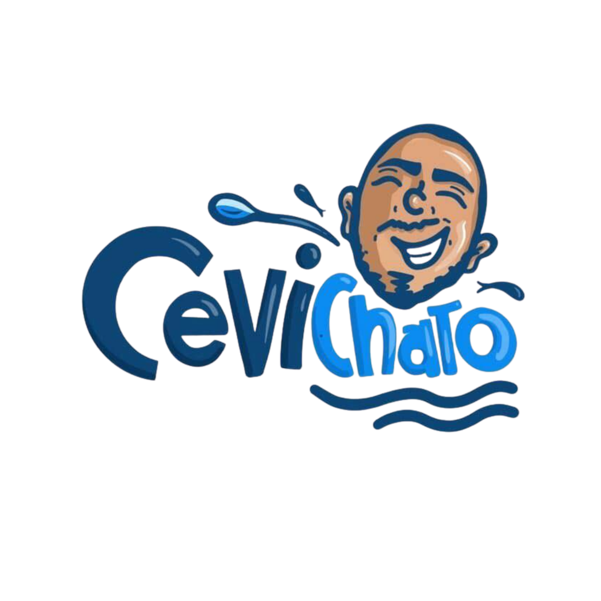

<a id="readme-top"></a>

[![project_license][license-shield]][license-url]
[![LinkedIn][linkedin-shield]][linkedin-url]

<!-- PROJECT LOGO -->
<br />
<div align="center">
  <a href="https://github.com/alonso06/cevichato-landing">
    
  </a>

<h3 align="center">Landing page - Cevichato </h3>

  <p align="center">
    Esta landing page formó parte de una estrategia de ventas por el día del trabajo para el restaruante "Cevichato".
    <br />
    <br />
    <a href="https://duo-cevichato.pages.dev/">Ver Demo</a>
  </p>
</div>

<!-- TABLE OF CONTENTS -->
<details>
  <summary>Tabla de contenidos</summary>
  <ol>
    <li>
      <a href="#acerca-del-proyecto">Acerca del proyecto</a>
      <ul>
        <li><a href="#stack">Stack</a></li>
      </ul>
    </li>
    <li>
      <a href="#empezando">Empezando</a>
      <ul>
        <li><a href="#prerrequisitos">Prerequisitos</a></li>
        <li><a href="#instalación">Instalación</a></li>
      </ul>
    </li>
    <li><a href="#licencia">Licencia</a></li>
    <li><a href="#contacto">Contacto</a></li>
  </ol>
</details>

<!-- ABOUT THE PROJECT -->

## Acerca del proyecto

Cevichato es un restaurante que realiza ofertas especiales en días festivos, es por ello que aprovechando el "día del trabajo" se realizó esta landing page, con la finalidad de centralizar la información sobre la oferta.
Esta landing page sirvió como parte de una estrategia de ventas que incluía la captación previa de clientes, mediante videos promocionales, concretando la venta mediante la página web, la cual, a su vez mostraba el stock en tiempo real y el tiempo de finalización de la oferta.

<p align="right">(<a href="#readme-top">ir al inicio</a>)</p>

### Stack

- 
- 
- [![TailwindCSS][TailwindCSS.com]][TailwindCSS-url]
- [![Cloudflare][Cloudflare.com]][Cloudflare-url]

<p align="right">(<a href="#readme-top">ir al inicio</a>)</p>

<!-- GETTING STARTED -->

## Empezando

### Prerrequisitos

Necesitas tener node y npm como administrador de paquetes.

### Instalación

1. Clonar el repositorio
   ```sh
   git@github.com:alonso06/cevichato-landing.git
   ```
2. Instalar los paquetes npm
   ```sh
   npm install
   ```
3. Ejecutar proyecto

   ```sh
   npm run dev
   ```

<p align="right">(<a href="#readme-top">ir al inicio</a>)</p>

## Licencia

Distribuido bajo la licencia del proyecto. Consulta la [Licencia](LICENSE). para más información.

<p align="right">(<a href="#readme-top">back to top</a>)</p>

<!-- CONTACT -->

## Contacto

Alonso Chiroque - alonsochrq@gmail.com

Project Link: [https://github.com/alonso06/cevichato-landing](https://github.com/alonso06/cevichato-landing)

<p align="right">(<a href="#readme-top">back to top</a>)</p>

<!-- ACKNOWLEDGMENTS -->

[license-shield]: https://img.shields.io/github/license/alonso06/palomero-app.svg?style=for-the-badge
[license-url]: https://github.com/alonso06/cevichato-landing/blob/main/LICENSE
[linkedin-shield]: https://img.shields.io/badge/-LinkedIn-black.svg?style=for-the-badge&logo=linkedin&colorB=555
[linkedin-url]: https://www.linkedin.com/in/alonso-chiroque-huamanchumo-9a1b0b188/
[product-screenshot]: images/screenshot.png

<!-- Shields.io badges. You can a comprehensive list with many more badges at: https://github.com/inttter/md-badges -->

[TailwindCSS.com]: https://img.shields.io/badge/tailwindcss-%2338B2AC.svg?style=for-the-badge&logo=tailwind-css&logoColor=white
[TailwindCSS-url]: https://tailwindcss.com/
[Cloudflare-url]: https://www.cloudflare.com/es-es/
[Cloudflare.com]: https://img.shields.io/badge/Cloudflare-F38020?style=for-the-badge&logo=Cloudflare&logoColor=white
